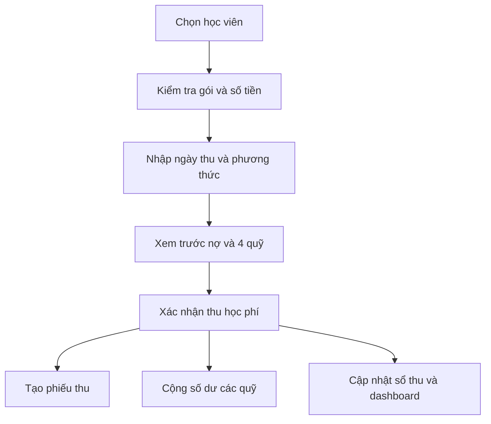

# Trinh N Yoga Studio - Product brief (MVP)

## 1. Bài toán kinh doanh

Trinh N Yoga thu học phí theo nhiều chu kỳ khác nhau: gói 1 tháng, gói 3 tháng và ngày thu riêng cho từng học viên. Việc theo dõi thủ công làm phát sinh ba rủi ro chính:

1. Quên hoặc thu trễ học phí vì không có lịch phải thu tập trung.
2. Không nhìn được doanh thu thực thu, khoản còn phải thu và gói sắp hết hạn trong cùng một màn hình.
3. Tiền học phí sau khi thu chưa được chia ngay theo kế hoạch tài chính, dẫn tới dùng lẫn tiền chi tiêu, quỹ khẩn cấp, tiết kiệm và đầu tư.

## 2. Mục tiêu sản phẩm

- Mỗi học viên có một hồ sơ duy nhất, gắn với gói học, học phí và ngày thu riêng.
- Trinh biết ngay hôm nay cần thu ai, số tiền bao nhiêu và gói nào sắp hết hạn.
- Một lần ghi nhận học phí tạo đồng thời phiếu thu và các bút toán phân bổ quỹ.
- Dashboard trả lời được bốn câu hỏi: đã thu bao nhiêu, còn phải thu bao nhiêu, tiền đang nằm ở quỹ nào và học viên nào cần xử lý.
- Thao tác chính “Thu học phí” hoàn tất trong dưới 30 giây trên điện thoại.

## 3. Người dùng và phạm vi

### Người dùng MVP

- **Chủ studio / Quản trị viên:** quản lý học viên, gói học, thu học phí, tỷ lệ phân bổ và báo cáo.
- **Huấn luyện viên (giai đoạn sau):** xem lịch học và tình trạng gói của học viên được phân công, không xem toàn bộ tài chính.

### Trong phạm vi MVP

- Dashboard vận hành và dòng tiền.
- Hồ sơ học viên, gói 1 tháng, 3 tháng và gói tùy chỉnh.
- Lịch phải thu theo ngày riêng của từng học viên.
- Thu học phí, ưu tiên trích nợ cố định rồi tự động phân bổ phần còn lại vào 4 quỹ.
- Sổ thu, lọc giao dịch, trạng thái đã thu / chờ thu / quá hạn.
- Cảnh báo gói sắp hết hạn và khoản đến hạn.
- Thêm, sửa, xóa học viên chưa có giao dịch; chuyển tình trạng `Duy trì / Ngừng tập` cho học viên đã có lịch sử tài chính.
- Điểm danh theo số buổi và gửi Telegram khi học viên còn đúng 2 buổi.

### Chưa nằm trong MVP

- Xếp lịch lớp, lịch phòng và phân công huấn luyện viên chi tiết.
- Thanh toán online, xuất hóa đơn điện tử và đối soát ngân hàng tự động.
- Kế toán thuế, lương huấn luyện viên và chi phí vận hành đầy đủ.
- Nhắn Zalo tự động (cần Zalo OA/API và sự đồng ý của học viên).

## 4. Quy tắc nghiệp vụ cốt lõi

### Gói học và kỳ thu

- Mỗi lượt đăng ký có tên gói, tổng số buổi, học phí, ngày bắt đầu, ngày kết thúc và ngày thu được nhập thủ công.
- Hệ thống không tự suy ra học phí hay thời hạn vì báo giá thay đổi theo số buổi và hình thức tập.
- Ngày phải thu thuộc về từng đăng ký học, không bắt buộc trùng ngày bắt đầu hoặc ngày kết thúc.
- Một học viên có thể gia hạn nhiều lần; lịch sử gói cũ phải được giữ lại.

### Trạng thái khoản phải thu

- **Sắp thu:** chưa đến ngày phải thu.
- **Đến hạn:** ngày phải thu là hôm nay hoặc nằm trong ngưỡng nhắc đã cấu hình.
- **Quá hạn:** đã qua ngày phải thu và tổng tiền thu chưa đủ.
- **Đã thu:** tổng phiếu thu hợp lệ bằng hoặc lớn hơn số tiền phải thu.

### Phân bổ quỹ

- Nợ cố định 3.000.000 ₫/tháng là ưu tiên bắt buộc. Các khoản thu trong tháng lần lượt bù đủ mục tiêu này trước.
- Chỉ phần học phí còn lại sau khi trích nợ mới được chia theo 4 tỷ lệ bên dưới.
- Mặc định prototype: Chi tiêu 50%, Khẩn cấp 20%, Tiết kiệm 15%, Đầu tư 15%.
- Tổng tỷ lệ luôn phải bằng 100% trước khi ghi nhận phiếu thu.
- Số tiền từng quỹ = phần học phí còn lại sau khi trích nợ × tỷ lệ tại thời điểm thu.
- Phiếu thu lưu “ảnh chụp” tỷ lệ đã áp dụng; đổi tỷ lệ về sau không làm thay đổi giao dịch cũ.
- Chênh lệch làm tròn được cộng vào quỹ Chi tiêu để tổng phân bổ luôn bằng đúng số tiền thu.
- Hoàn tiền phải tạo giao dịch đảo chiều, không xóa phiếu thu đã phát sinh.

### Số buổi và Telegram

- Mỗi lần điểm danh tăng `Sessions_Used` một đơn vị và tính lại `Sessions_Remaining`.
- Khi số buổi còn lại chuyển thành đúng 2, Apps Script gửi Telegram tới TrinhNYoga.
- `Low_Session_Alert_At` ngăn gửi lặp lại cùng một cảnh báo.
- Chỉnh lại tổng số buổi làm số buổi còn lại khác 2 sẽ mở lại khả năng cảnh báo cho chu kỳ tiếp theo.

## 5. Luồng chính

## 6. Mô hình dữ liệu đề xuất

| Thực thể | Trường chính | Ghi chú |
| --- | --- | --- |
| `students` | id, name, phone, status, membership_state, note, total_sessions, sessions_used, sessions_remaining | Hồ sơ, tình trạng duy trì/ngừng tập và số buổi |
| `plans` | id, name, duration_months, default_fee | Danh mục gói |
| `enrollments` | id, student_id, plan_id, start_date, end_date, due_date, fee, status | Một lần đăng ký/gia hạn |
| `payments` | id, enrollment_id, amount, paid_at, method, note, created_by | Phiếu thu bất biến |
| `funds` | id, name, color, target_amount | Bốn phong bì tài chính |
| `allocation_rules` | id, effective_from, percentages_json | Bộ tỷ lệ có hiệu lực |
| `payment_allocations` | payment_id, fund_id, rate_snapshot, amount | Bút toán quỹ của từng phiếu thu |

## 7. Chỉ số trên Dashboard

- Doanh thu thực thu tháng này.
- Khoản phải thu còn lại và số học viên quá hạn.
- Học viên đang hoạt động, học viên mới và gói sắp hết hạn.
- Tổng số dư từng quỹ trong tháng / toàn thời gian.
- Tỷ lệ thu đúng hạn và doanh thu theo tuần.

## 8. Tiêu chí nghiệm thu MVP

1. Thêm được học viên với gói, học phí và ngày thu tùy chọn.
2. Danh sách hiển thị đúng trạng thái theo ngày phải thu.
3. Ghi nhận học phí tạo đúng một phiếu thu, một dòng trích nợ và bốn dòng phân bổ quỹ.
4. Không cho lưu nếu tỷ lệ phân bổ khác 100%.
5. Tổng tiền trả nợ và bốn quỹ luôn bằng tổng tiền thực thu, kể cả sau làm tròn.
6. Dashboard và sổ thu cập nhật ngay sau giao dịch.
7. Giao diện dùng tốt ở màn hình 390 px và desktop từ 1280 px.
8. API Google Apps Script bắt buộc kiểm tra token bí mật và khóa ghi đồng thời.
9. Thêm và sửa được đầy đủ hồ sơ; chỉ xóa được học viên chưa có phiếu thu.
10. Điểm danh cập nhật đúng số buổi và gửi Telegram một lần khi còn đúng 2 buổi.

## 9. Lộ trình triển khai

- **Prototype hiện tại:** giao diện tương tác, khởi tạo trống, lưu `localStorage`, kiểm chứng luồng nghiệp vụ.
- **MVP dùng chung:** Google Sheet làm nguồn dữ liệu, Google Apps Script làm API có token và khóa ghi; dashboard hiển thị trạng thái trống khi chưa kết nối.
- **MVP production quy mô lớn:** chuyển sang Supabase Auth + Postgres + RLS khi cần nhiều người dùng, phân quyền sâu hoặc lượng giao dịch lớn.
- **Giai đoạn 2:** nhắc học phí qua Zalo, điểm danh, lịch lớp, báo cáo chi phí và đối soát ngân hàng.
